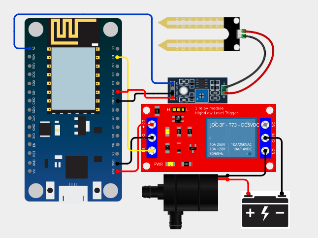

# 🌱 Smart Irrigation System using ESP8266 & Blynk

## 📌 Overview

This project is an IoT-based Smart Irrigation System that monitors soil moisture levels and sends real-time notifications when the soil becomes dry. The system allows users to manually control a water pump using the Blynk mobile application.

---

## 🚀 Features

* 🌱 Real-time soil moisture monitoring
* 📲 Instant mobile notification alerts (via Blynk)
* 🔘 Manual motor ON/OFF control from mobile app
* 📊 Live data display on dashboard
* 🔄 Reliable WiFi-based communication
* 🧠 Spam-protected notification system

---

## 🧰 Components Used

* ESP8266 (NodeMCU)
* Soil Moisture Sensor
* Relay Module (5V)
* Water Pump (DC)
* Battery / Power Supply
* Jumper Wires

---

## 🔌 Circuit Connections

### 🌱 Soil Moisture Sensor → ESP8266

| Sensor Pin | ESP8266 Pin |
| ---------- | ----------- |
| VCC        | 3.3V        |
| GND        | GND         |
| AO         | A0          |

---

### 🔌 Relay Module → ESP8266

| Relay Pin | ESP8266 Pin |
| --------- | ----------- |
| VCC       | Vin         |
| GND       | GND         |
| IN        | D1          |

---

### 💧 Pump + Battery + Relay

| Connection             | Description       |
| ---------------------- | ----------------- |
| Battery (+) → COM      | Power input       |
| NO → Pump (+)          | Controlled output |
| Pump (-) → Battery (-) | Complete circuit  |

---

## ⚙️ Working Principle

1. The soil moisture sensor continuously reads soil conditions.
2. If the soil becomes dry (value above threshold):

   * A notification is sent to the Blynk app.
3. The user receives the alert and can:

   * Turn ON the water pump using the app button.
4. Once watering is complete, the user can turn OFF the pump.

---

## 📱 Blynk Setup Guide (Step-by-Step)

### 🔧 Step 1: Install App

Download and install the Blynk IoT app.

---

### 🧩 Step 2: Create Template

* Template Name: `Soil Monitor`
* Hardware: `ESP8266`
* Connection Type: `WiFi`

---

### 🔌 Step 3: Create Datastreams

#### Soil Moisture

* Name: Soil Value
* Pin: V0
* Type: Integer
* Range: 0–1023

#### Motor Control

* Name: Motor Control
* Pin: V1
* Type: Integer
* Range: 0–1

---

### 🔔 Step 4: Create Event

* Event Name: `soil_low`
* Enable Push Notification
* Select Device Owner

---

### 📱 Step 5: Mobile Dashboard

* Button → V1 (Switch mode)
* Value Display / Gauge → V0

---

### 🔑 Step 6: Get Auth Token

Copy from device info and paste in code.

---

### 🚀 Step 7: Run Project

* Upload code
* Power device
* Open app

✔ Dry soil → Notification
✔ Button ON → Pump ON
✔ Button OFF → Pump OFF

---

## 💻 Code Setup (Important)

### 🔑 Replace Blynk Credentials

```cpp
#define BLYNK_TEMPLATE_ID "YourTemplateID"
#define BLYNK_TEMPLATE_NAME "Soil Monitor"
#define BLYNK_AUTH_TOKEN "YourAuthToken"
```

---

### 🌐 Replace WiFi Credentials

```cpp
char ssid[] = "YourWiFiName";
char pass[] = "YourPassword";
```

---

### 🌱 Adjust Threshold

```cpp
int threshold = 600;
```

---

### 🔌 Check Pins

```cpp
#define soilPin A0
#define relayPin D1
```

---

### 🔔 Event Name

```cpp
Blynk.logEvent("soil_low");
```

---

## 📷 Circuit Diagram



---

## 🧪 Testing

* Dry soil → Notification received
* Button ON → Pump starts
* Button OFF → Pump stops

---

## ⚠️ Safety Notes

* Avoid using AC pump directly
* Use proper power supply
* Do not keep sensor in water continuously

---

## 🔮 Future Improvements

* Automatic irrigation
* Water level sensor
* LCD display
* Cloud data logging

---

## 👨‍💻 Author

**Anirudhdha Poriya**

---

## ⭐ Support

If you like this project, please ⭐ star the repository!
